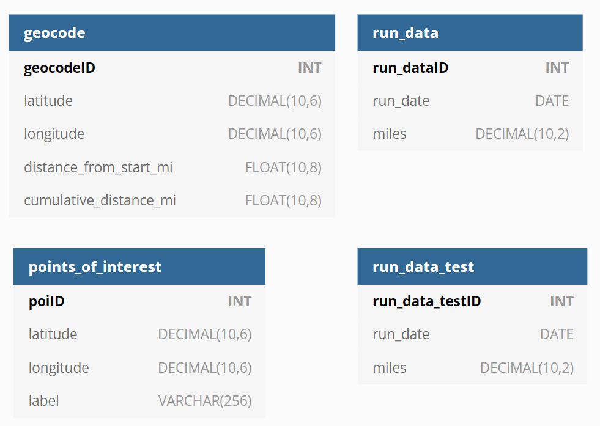

# Dependencies
## Packages
RunTracker relies on the following Python packages to run:

- plotly
- pandas
- MySQLdb
- json
- google-python-api

## Database
The database by default is MySQL. The structure of the database underlying the current code is as follows:
#### Tables
- geocode
- run_data
- points_of_interest
- run_data_test

`run_data_test`is used when `dev` mode is specified in the command line arguments.